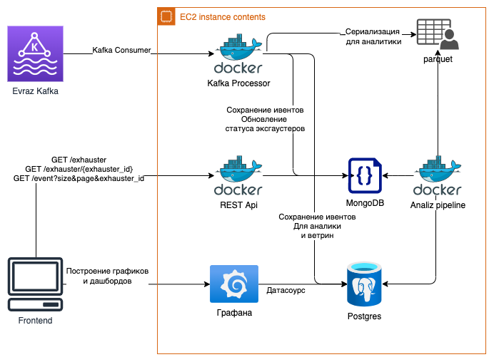
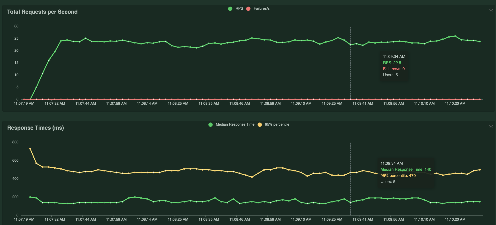
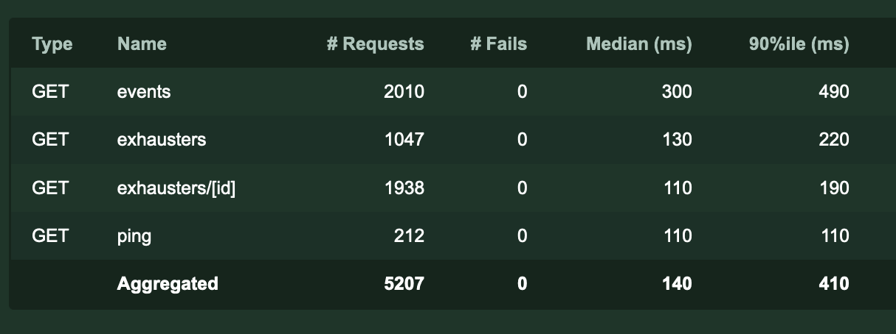

### Команда
МИСИС анимешники!
Состав:
- Петер Ибрагимов, капитан команды, бекенд-девопс разработчик
- Артём Соседка, дата аналитик
- Евгений Четвертков, фронтенд разработчик
- Илья Киселевский, бекенд-девопс разработчик
- Яна Рыхлицкая, UI-UX дизайнер.

### Что надо
Разработать веб-приложение, с помощью которого машинист эксгаустера сможет мониторить состояние эксгаустеров и прогнозировать их возможную поломку.

Основа работы сервиса - поток реальных данных с датчиков агрегата через Kafka.

### Решение


Решение представляет собой сервис, состоящий из 5и частей:
- `MongoDB` - _No-SQL_ база данных для сохранения состояний экстраудеров и всех ивентов для последующей индексации по ним
- `RESTApi` - _FastAPI-based_ рест апи, для вывода данных на фронтенд
- `Kafka Processor` - процессинг ивентов из кафки
- `Analizer` - сервис анализа состояний экстраудеров для предсказаний
- `Frontend` - _React-based_ веб-сайт, для визуализации работы экстраудеров и предсказаний по ним

### Доступ
Фронтенд сайт доступен по http://158.160.13.117
Swagger доступен по http://158.160.13.117:8000/docs

### Запуск
- backend:
```
cd backend
docker-compose up
```

### Нагрузочное тестирование
В случае нагрузки, поставляемой 100 пользователей, средний ответ составляет 1.4c, при нагрузке 50 запросов в секунду.


